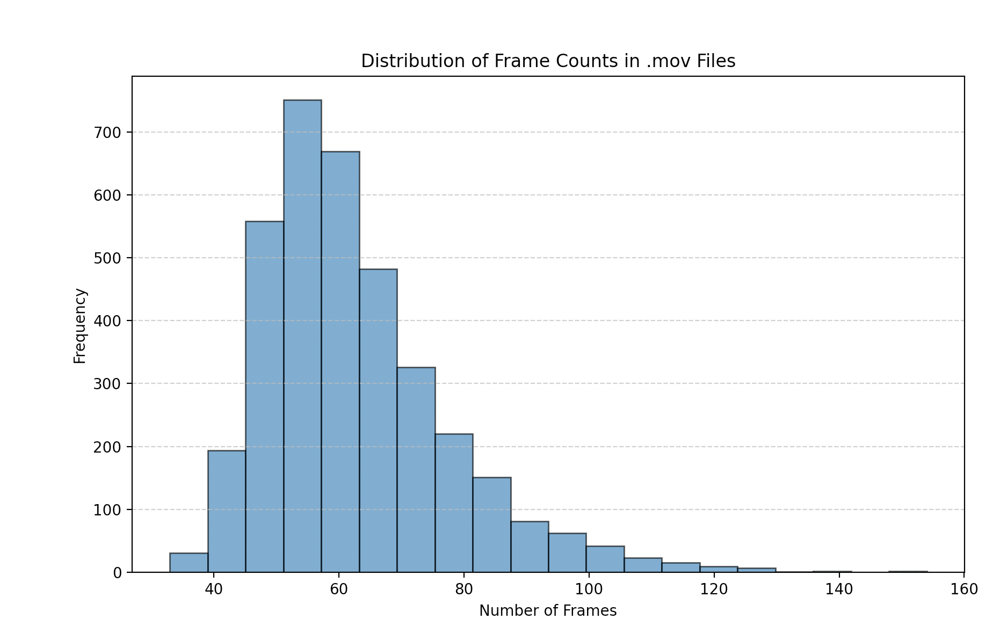

# BiLSTM Baseline for ISL Recognition

The pipeline processes video input through hand detection, extracts 21 keypoints per hand as (x, y) coordinates, normalizes sequences to 60 frames, and classifies them into 15 sign categories using a 2-layer BiLSTM with 128 hidden units per direction.

## Architecture

The system follows a three-stage pipeline: 
1. **MediaPipe extraction** converts raw video frames into structured hand landmark sequences stored in HDF5 format
2. **preprocessing** handles variable-length sequences through padding (either frame repetition or linear interpolation) to a fixed 60-frame window; 
3. **classification** uses stacked bidirectional LSTMs with dropout (0.5) that process the temporal sequence and use only the final hidden state for prediction. Training uses Adam optimizer with cross-entropy loss, batch size 16, and supports both standard train/val/test splits (70/15/15) and person-independent evaluation.

## Hand Landmark Visualization

Sample MediaPipe detections on ISL adjective signs:

| Sign | Demo |
|------|------|
| Happy | [hand_landmarks_viz_Adjectives_happy_MVI_5183.mp4](assets/hand_landmarks_viz_Adjectives_happy_MVI_5183.mp4) |
| Loud | [hand_landmarks_viz_Adjectives_loud_MVI_5177.mp4](assets/hand_landmarks_viz_Adjectives_loud_MVI_5177.mp4) |
| Rich | [hand_landmarks_viz_Adjectives_rich_MVI_9596.mp4](assets/hand_landmarks_viz_Adjectives_rich_MVI_9596.mp4) |
| Short | [hand_landmarks_viz_Adjectives_short_MVI_5110_E.mp4](assets/hand_landmarks_viz_Adjectives_short_MVI_5110_E.mp4) |

## Frame Distribution

